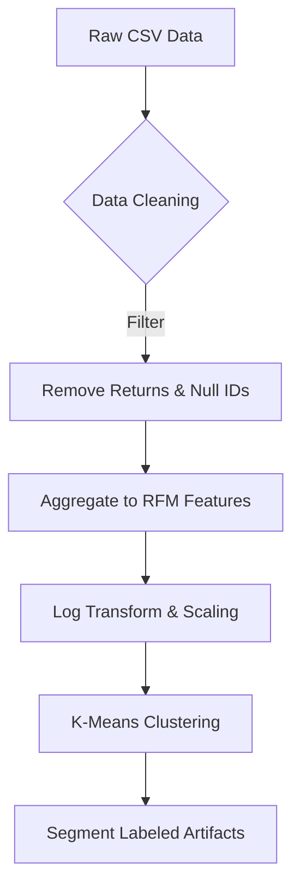
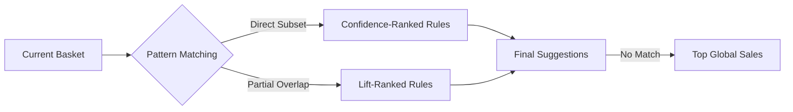

## System Workflows

### 1. Data Pipeline Flow

### 2. Recommendation Logic

## Analytical Deep Dive

### Customer Segmentation (RFM + K-Means)
The system employs a two-staged approach for segmentation:

- **RFM Transformation**: Raw transaction data is aggregated to compute:
    - **Recency**: Days since last purchase. Low recency = HIGH vibrancy.
    - **Frequency**: Total number of transactions. High frequency = HIGH engagement.
    - **Monetary**: Total spend. Log-scaled to reduce the influence of high-spending outliers.
- **Clustering (K-Means)**: The RFM vectors are normalized using `StandardScaler`. K-Means clustering is then applied. We chose 5 clusters as the "Elbow Point" where within-cluster sum of squares (WCSS) starts to diminish.

### Association Rule Mining (Apriori)
The Apriori algorithm mines "hidden" relationships between products:

- **Support**: How often a product set appears (e.g., 0.01 Support means 1% of all invoices).
- **Confidence**: The reliability of the rule (e.g., 0.20 Confidence means 20% of customers who bought A also bought B).
- **Lift**: The "Strength" of the rule. Lift > 1 implies A and B are positively associated.

## Performance Decisions

- **Pre-calculation**: Rules are generated in the `train.py` script, NOT on the fly. This keeps the UI lightning fast even with thousands of rules.
- **Modular Core**: Analytical logic is separated from UI code, allowing for easy integration into other platforms (web, mobile, or enterprise ERPs).
